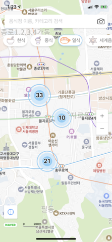
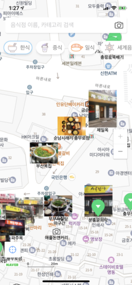

# iOS_map_clustering
개발 기간 : 2020년 05월 11일  ~ 2020년 5월 22일

## [ About ]
**2020 NAVER CAMPUS HACKDAY 지도에 표시하는 이미지 클러스터링 프로젝트**입니다.
### 프로젝트 설명
지도에 표시되는 음식점의 사진들을 음식점 카테고리에 맞게 클러스터링을 다양하게 표현 합니다. 네이버 지도에서 사용자들은 다양한 장소의 정보를 쉽고 빠르게 찾기를 원하고 있습니다. 특히 음식점 사진은 실제 음식의 사진을 중심으로 찾기를 원하기도 하고 같은 종류의 음식점들의 사진을 비교하기도 합니다. 또한 쉽게 찾기 위해서 지도 위에 표시되는 음식점의 숫자에 대한 밀도를 조절해야 하기도 합니다. 위와 같은 니즈를 만족할 수 있는 앱의 인터랙션 개발합니다.

## [ Get Started ]
### 1.CocoaPods 구성
CocoaPods 인스톨이 필요합니다.
### 2.클라이언트 ID 지정
네이버 지도 SDK를 사용하기 위해 네이버 클라우드 플랫폼에서 클라이언트 ID를 발급받고 Info.plist의 NMFClientId에 입력합니다.

## [ Preview ]
| 스크린샷1                    | 스크린샷2                                  | 사용예시                                  |
|:------------------------------:|:---------------------------------:|:---------------------------------:|
| | | |

## [ Develop Environment ]
- iOS Depolyment Target : `Xcode 11.4.1`
- CocoPods Version:  `1.9.1`

## [ Library ]
- [NMapsMap](https://github.com/navermaps)
- [SwiftLint](https://github.com/realm/SwiftLint)
- [Kingfisher](https://github.com/onevcat/Kingfisher)

